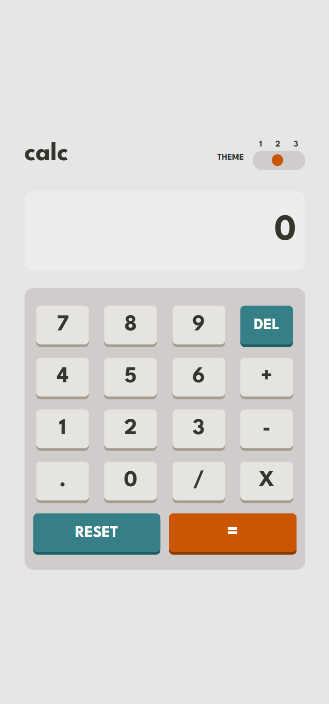

# Frontend Mentor - Calculator app solution

This is a solution to the [Calculator app challenge on Frontend Mentor](https://www.frontendmentor.io/challenges/calculator-app-9lteq5N29). Frontend Mentor challenges help you improve your coding skills by building realistic projects.

## Table of contents

- [Overview](#overview)
  - [The challenge](#the-challenge)
  - [Screenshot](#screenshot)
  - [Links](#links)
- [My process](#my-process)
  - [Built with](#built-with)
  - [What I learned](#what-i-learned)
  - [Continued development](#continued-development)
- [Author](#author)

## Overview

### The challenge

Users should be able to:

- See the size of the elements adjust based on their device's screen size
- Perform mathmatical operations like addition, subtraction, multiplication, and division
- Adjust the color theme based on their preference
- **Bonus**: Have their initial theme preference checked using `prefers-color-scheme` and have any additional changes saved in the browser

### Screenshot





### Links

- Solution URL: [Add solution URL here](https://your-solution-url.com)
- Live Site URL: [Calculator App](https://calculator-smartlify.netlify.app/.com)

## My process

### Built with

- Semantic HTML5 markup
- CSS custom properties
- Flexbox
- CSS Grid

### What I learned

Using ternary operations can be useful at times, but the traditional if statements will also come in handy, depending on what is trying to be achieved.

I also learned how to use destructuring to extract data from the theme_data, such as background colors, colors, e.t.c.

```js
const {
  backgroundColor,
  keyBgColor,
  keyTextColor,
  resetBtnColor,
  equalsBtnColor,
  textColor,
  screenBg,
  keyPadBg,
  shadow,
  hover,
} = themes[currentTheme];
```

### Continued development

For continued development, I'm planning on implementing a way to keep track of calculations.

## Author

- Website - [Obinna Anosike Smart](https://portfolio-web-smartlify.netlify.app/.com)
- Frontend Mentor - [@smartlify08](https://www.frontendmentor.io/profile/smartlify08)
- Twitter - [@smartlify09](https://www.twitter.com/smartlify09)
